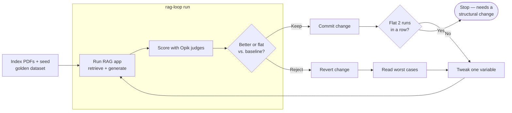

# RAG Loop Flowchart

Notes on the diagram:
- Everything inside `rag-loop run` is automated (`src/rag_loop/loop.py: run_iteration`) — one
  command runs the experiment, persists it, decides keep/reject, records the verdict, and handles
  git. The only manual step is `Tweak`: reading the failures and writing the next single-variable
  change.
- `rag-loop seed` doesn't overwrite the Opik dataset in place; every run creates a new version, and
  a single `rag-loop run` pins one version so its result is only ever compared to results scored
  against that same version.
- The app (retrieval + generation) runs on Gemini; the three Opik judges deliberately run on a
  different provider (OpenAI `gpt-5.4-nano`) so the judge isn't the same model family grading its
  own output.
- For a one-off multi-config sweep with no keep/reject bookkeeping, use `rag-loop loop --config
  evals/configs.json` instead — it skips the `Verdict`/`Commit`/`Revert` steps entirely.
- `Plateau` = kept, but 2 kept runs in a row moved no metric. Not an error — it means prompt/config
  tweaking has stopped helping and the next change should be structural instead.
